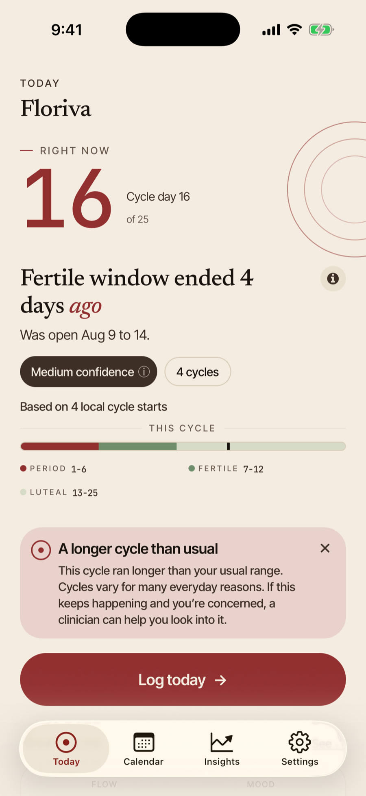
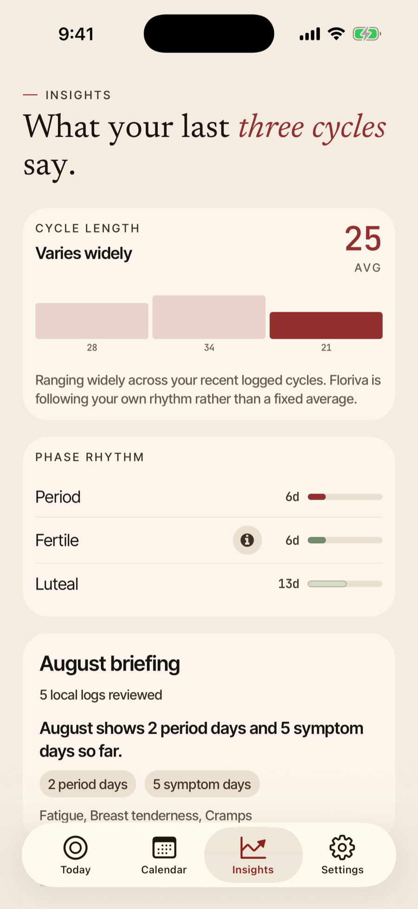

# Floriva

A privacy-first period tracker for iOS and Android. No account, no backend, no analytics, and
zero network call sites in the application code.

Floriva shipped to the App Store and Google Play, ran as a paid product, and was
retired in August 2026 when the company behind it closed. Its final release
removed the paywall and made everything free. This repository is the engineering
record of that work, published as a portfolio piece.

<p align="center">
  
  
  
</p>

---

## By the numbers

Every figure below is produced by [`scripts/collect-portfolio-metrics.js`](floriva-app/scripts/collect-portfolio-metrics.js)
into [`metrics.json`](metrics.json), and was cross-checked by a second
independent measurement pass. Where two methods disagreed, the disagreement is
recorded in [`docs/metrics.md`](docs/metrics.md) rather than resolved silently.

The figures are still *transcribed* into this prose by hand, and hand
transcription drifts: three different values for the same test-code line count
once coexisted across three of these documents. So the transcription is checked
by a test:
[`checkDocFigures.test.ts`](floriva-app/tests/scripts/portfolio/checkDocFigures.test.ts)
re-reads `metrics.json` and fails if any document quotes a stale number.

| | |
| --- | --- |
| **Product code** | 297 files · 50,485 lines |
| **Test code** | 77,987 lines (**1.54 lines of test per line shipped**) |
| **Test suite** | 287 suites · 4,596 tests · 0 focused |
| **Coverage** | 98.80% lines · 99.70% functions · 90.67% branches |
| **Coverage gate** | 95% floor on lines, statements and functions, enforced **per file**, locally, not in CI |
| **End-to-end** | 22 Detox specs · 44 scenarios · iOS + Android |
| **Database** | 20 migrations · 15 SQLite tables |
| **Localization** | 8 locales · 1,107 strings each · **0 key drift** |
| **Screens** | 72 route files → 51 distinct screens |
| **Network calls in app code** | **0** |
| **Analytics / crash / ad SDKs** | **0** |
| **History** | 706 commits · April to August 2026 |

Coverage and gating, precisely:

- **Coverage covers 243 of 297 product files.** Jest's `collectCoverageFrom`
  config carries 65 exclusion patterns, mostly route and screen wrappers; the
  54 files that fall out of collection do not appear at 0% and drag the
  average down. They do not appear at all.
- **The coverage gate never ran in CI.** `.github/workflows/ci.yml` runs
  `pnpm lint`, `pnpm typecheck` and `pnpm test:ci`. `test:ci` is
  `jest --ci` with no `--coverage`, so neither jest's own threshold nor the
  per-file script (`scripts/check-coverage.js`, wired into
  `pnpm test:coverage:check`) executes on a push or a pull request. The gate is
  real and it passes; it was run by hand before a release.

---

## What's actually interesting here

### There is no networking code in the app

There are **zero** `fetch`, `XMLHttpRequest`, `WebSocket`, or `axios` call sites
in the entire application: `src/`, `app/`, `components/`, `constants/`,
`drizzle/`. Not "we don't collect much." None.

```bash
grep -rE "\bfetch\(|XMLHttpRequest|new WebSocket|axios" src app components constants drizzle
# no matches
```

No analytics SDK, no crash reporter, no ad network, no session replay: none
were ever added. Every way data can leave the device is an explicit OS hand-off
the user initiates: a StoreKit / Play Billing purchase, the system review sheet,
a `mailto:` link, or opening the privacy policy in a browser.

The honest footnote: on Android, `expo-notifications` pulls in Firebase Cloud
Messaging transitively, so the messaging classes are present in the shipped AAB.
With no `google-services.json` in the project, Firebase cannot initialise a
default app, and no push token is ever requested. That's a *"does not fire"*
argument, not a *"not present"* one, and [`docs/privacy-and-security.md`](docs/privacy-and-security.md)
says so plainly. We only know it because we disassembled our own release build.

### We audited our own marketing and found it lying

In July 2026 the project ran a full self-audit against its own public claims.
It found one P0: **the marketing said "encrypted sync" and "zero-knowledge" for
a product that has no server at all.** The audit is checked into this repo at
[`floriva-app/docs/strategy/`](floriva-app/docs/strategy/), next to the code that
proves it.

That audit is why this README does not claim encrypted local storage. The
database is an ordinary SQLite file:

```ts
// src/db/client.ts
const sqlite = openDatabaseSync('floriva.db');
```

No SQLCipher, no key. Application-layer database encryption was scoped and
designed as its own release; the company closed first. Biometric lock is an
*app-access screen gate*, not a decryption key: it stores a random marker in
the keychain and flips React state. Saying otherwise would be the easy lie.

What *is* genuinely encrypted: the user-created `.floriva` backup export.

### Backup crypto with the reasoning checked in beside it

[`src/features/backup/backupPackage.ts`](floriva-app/src/features/backup/backupPackage.ts)
seals the export with AES-256-GCM under a PBKDF2-SHA256 key (210,000
iterations). Three decisions in it are worth reading:

- **KDF iteration bounds are enforced at _decrypt_ time**, so an attacker-supplied
  envelope header can neither weaken the KDF nor force a denial of service by
  demanding ten million rounds.
- **All-NUL passphrases are rejected at the trust boundary.** PBKDF2's inner
  HMAC zero-pads its key block, so a passphrase of NUL bytes derives the same key
  as an empty one. The whole collision class is refused rather than reasoned
  about case by case.
- **The key check is compared in constant time.**

And the limitation, stated rather than buried: the envelope *header* (format
version, KDF parameters, salt, nonce, timestamp) is cleartext and outside the
AEAD, by design, so the file is self-describing. The payload is encrypted and
authenticated. The metadata describing how to decrypt it is not.

### A migration bug that only bites users who already upgraded

`drizzle/meta/_journal.json` had out-of-order timestamps: entries 11, 12 and 13
all carried `when` values *below* entry 10's. Drizzle's migrator advances on
`folderMillis`, so any install already at migration 10 silently skipped the next
three: no error, no crash, just three missing columns on exactly the users who
had been around longest.

[`src/db/runtimeSchemaRepair.ts`](floriva-app/src/db/runtimeSchemaRepair.ts) is
the fix: 85 lines of idempotent, add-column-only SQL that runs at startup and
heals the schema in place.

### Predictions that decline to guess

The engine ([`src/lib/predictions/`](floriva-app/src/lib/predictions/), 21 `.ts`
modules, 16 at the top level plus 5 under `signals/`) is descriptive statistics
over the user's own logged history. It uses no model, calls no server, and
makes no claim to clinical validity:

- **MAD-based outlier rejection** with the standard 1.4826 consistency constant,
  then a recency-weighted median.
- **Two spreads returned on purpose**: filtered for prediction windows, raw for
  honesty about how consistent cycles actually are.
- **Ovulation signal fusion** across basal temperature (Marshall's three-over-six
  rule), OPK surge, and cervical mucus, weighted 3/3/2/1, with an explicit
  *decline-to-guess* path when signals conflict.
- **A retrospective-honesty rule**: a temperature-derived estimate, which is only
  knowable after the fact, may never open a *future* fertile window.

Most fertility surfaces carry a non-medical disclaimer. Two do not, and that is
worth stating precisely rather than rounding up. Every `PredictionResult` carries
`not-medical-certainty` as a baseline limitation, rendered by the *About these
estimates* sheet; Today, the Calendar month grid, the Insights phase chart and
the logging sheet each put a help tooltip next to the fertility UI; Settings has
three more. But
[`src/features/insights/screens/InsightsTtcScreen.tsx`](floriva-app/src/features/insights/screens/InsightsTtcScreen.tsx)
renders a fertile-window headline and
[`src/features/calendar/screens/CalendarDayScreen.tsx`](floriva-app/src/features/calendar/screens/CalendarDayScreen.tsx)
renders a phase pill that can read "Fertile". Neither file contains a
disclaimer, a tooltip, or a limitation code.

### Tests as the primary interface

4,596 tests at a 95% per-file floor,
not a global average that lets weak files hide behind strong ones. That floor is
a separate script run by hand before a release, not a CI gate: CI runs lint,
typecheck and `jest --ci` without coverage. The suite
includes 53 adversarial files and a `tests/sanity/` directory that tests the
*build itself*: that the Detox config matches the native projects, that the
release preflight script agrees with the manifests, that every `testID` is
unique.

It is also **deterministic**: run under two different concurrency settings
(190s single-worker vs 80s parallel), it produces identical test identities and
zero per-file coverage differences.

---

## Architecture

```
app/          Expo Router routes: orchestration only, 1,059 lines total
              ├─ zero imports from src/lib. The layering rule actually holds.
src/
  features/   Feature flows, each owning its screens and model
  lib/        Domain logic: predictions, parsing, notifications, security
  db/         Drizzle + expo-sqlite: schema, repositories, validators, repair
  theme/      Tokens and primitives
  localization/  8 locales across 16 message modules
```

The rule was *domain logic never lives in a screen*. It holds where it counts:
the entire routing tree contains no domain imports, and seven pure screen-model
builders (2,220 lines) sit between features and their React components so that
screen behaviour is unit-testable without rendering.

It does not hold everywhere, and [`docs/architecture.md`](docs/architecture.md)
names the five places it leaks, including a 2,488-line `SettingsScreen.tsx`
that hosts ten route screens and reaches into `collectPeriodStarts` directly.

Full detail: [architecture](docs/architecture.md) ·
[privacy & security](docs/privacy-and-security.md) ·
[predictions](docs/predictions.md) · [import](docs/import.md) ·
[testing](docs/testing-and-quality.md) · [design system](docs/design-system.md) ·
[localization](docs/localization.md) ·
[release engineering](docs/release-engineering.md) ·
[metrics](docs/metrics.md) · [screenshots](docs/screenshots.md)

---

## Stack

Expo 54 · React Native 0.81 · TypeScript 5.9 · Expo Router 6 · expo-sqlite +
Drizzle ORM · Zod · `@noble/ciphers` · Detox · Jest + React Native Testing
Library. 47 runtime dependencies, 15 dev.

## Running it

```bash
cd floriva-app
pnpm install
pnpm test          # 287 suites
pnpm typecheck
pnpm lint
pnpm ios           # or: pnpm android
```

Nothing else is required: no API keys, no services, no `.env` to populate. The
app is fully functional offline on first launch.

---

## About this snapshot

This is a sanitized export of a private repository, published as one commit.

Removed: signing keys and store credentials (never committed in the first
place), release-operations runbooks containing personal and third-party contact
details, store-account identifiers, and QA captures showing a real sandbox
account. Three test files went with them: 3 of 290, which is why the count here
reads 287 and not 290.

Two are release-operations guard tests that assert on the *contents* of the
excluded runbooks; with their subject documents gone they cannot pass. The third
is `tests/scripts/portfolio/sanitize.test.ts`, and it is out for a stranger
reason: it cannot survive its own pipeline. Its fixtures are, by construction,
the exact strings the sanitizer's rewrite pass replaces, so the emitted copy
asserted that the *anonymized* form `~/Code/floriva` trips the developer-home-path
rule. But `~` is precisely what that rule rewrites paths *to*. Shipping a copy
that fails, or one edited until it passes vacuously, is worse than shipping
neither and saying so. The sanitizer itself is still here, and is the part worth
reading: [`scripts/portfolio/sanitize.js`](floriva-app/scripts/portfolio/sanitize.js).

Two further cases skip here rather than failing, both environmental. One in
[`tests/sanity/store-screenshot-config.test.ts`](floriva-app/tests/sanity/store-screenshot-config.test.ts)
asserts on a store-asset guide that lives in a sibling marketing package this
snapshot does not include. One in
[`tests/scripts/portfolio/metrics.test.ts`](floriva-app/tests/scripts/portfolio/metrics.test.ts)
asserts the repository holds more than 700 commits. That is true of the private
repo, and not of a snapshot published as one squashed commit. `pnpm test` therefore
reads *4,594 passed, 2 skipped* out of 4,596 here, against 4,695 in the private
repository, which also carries the three removed files and their 99 cases
(4,695 − 99 = 4,596). All of it is recorded in
[`docs/testing-and-quality.md`](docs/testing-and-quality.md).

Screenshots are freshly captured from the 1.4.0 build via the Detox harness in
[`floriva-app/e2e/`](floriva-app/e2e/), on iOS 26.4 and Android API 35.

## License

**All rights reserved.** See [LICENSE](LICENSE). This code is published for
portfolio review only: it is not open source, and no license to use, copy,
modify, or distribute it is granted.
